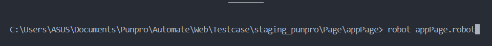
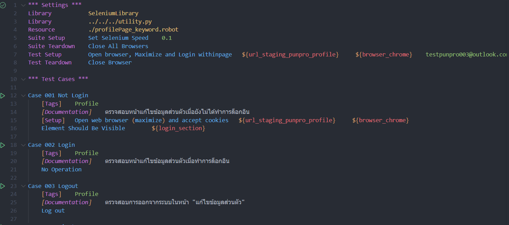

# Punpro Webpage Automate Testing

## How to run Robot Framework

### - Requirement

1. **Python 3+**
    - ตัว Robot Framework เป็น Python-based และใช้ภาษา Python ในการสร้าง Library จึงจำเป็นต้องลง
    - ดาวน์โหลด Python https://www.python.org/downloads/

2. **Robot Framework**
    - เป็น Framework ที่จะใช้งาน
    - จำเป็นต้องลง Python 3+ เพื่อใช้งาน pip (Python Package Manager)
    - ใช้คำสั่ง ``` pip install robotframework ``` ใน Terminal (CMD/ Windows PowerShell for Windows)

3. **Selenium Library**
    - ใน project นี้จะใช้ Selenium Library ซึ่งใช้สำหรับ Web Automation 
    - Robot สามารถใช้ library อื่นๆได้เช่น Playwright (ใน robot จะชื่อว่า Browser Library)
    - ใช้คำสั่ง ```pip install robotframework-Seleniumlibrary``` ใน Terminal (CMD/ Windows PowerShell for Windows)

4. **Browser Driver**
    - ใน project นี้จะทำการบน test บน Chorme เป็นหลัก สามารถดาวน์โหลด driver ให้ตรงตามเวอร์ชั่นของตัวเองได้ที่ https://googlechromelabs.github.io/chrome-for-testing/
    - หากต้องการ test บน browser อื่นๆ จำเป็นต้องโหลด Driver นั้นๆ
    - ***ทำการ Set Path ให้เรียบร้อยเพื่อให้หา Driver เจอ***
        - Windows https://www.youtube.com/watch?v=h-ipsQEiyyk
        - macOS สามารถติดตั้งและใช้ Homebrew ในการ Set Path ได้เพื่อความง่าย https://formulae.brew.sh/cask/chromedriver

5. IDE
    - ใน project นี้ใช้เป็น Visual Studio Code เพราะมี Extension สำหรับ Robot คือ ***Robot Code*** เพื่อความง่าย

### -วิธีการ Run Robot

### 1. ผ่าน Terminal
- เปิด Terminal ใน VS Code แล้วไปที่ Folder ที่ไฟล์ (.robot) นั้นอยู่ โดยต้องเป็นไฟล์ที่มี ```*** Test Cases ***``` อยู่เท่านั้น แล้วพิมพ์ ```robot (ชื่อไฟล์).robot``` 



### 2. กดปุ่มเล่นข้างๆ (ต้องมี Extension 'Robot Code')

